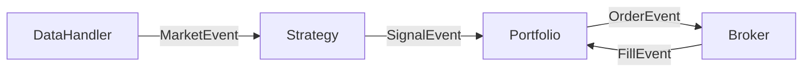

# Backend

Event-driven trading engine for backtesting and live trading.

## What This Does

EventChainTrader is an event-driven backtesting system that simulates how a trading strategy would have performed on historical data. The same architecture can be used for live trading by swapping out the data handler.

The system processes market data bar-by-bar (like a real market feed), detects trading signals based on your strategy, generates orders, and simulates execution with realistic commission calculations.

## How It Works

The engine uses an event queue to decouple components. Each component only knows about events, not other components:

1. **DataHandler** reads market data (from CSV or live feed) and emits `MarketEvent`
2. **Strategy** receives market data, analyzes it, and emits `SignalEvent` when conditions are met
3. **Portfolio** receives signals, manages position sizing, and emits `OrderEvent`
4. **Broker** receives orders, executes them (simulated or real), and emits `FillEvent`
5. **Portfolio** receives fills and updates positions/cash

This loop continues until all data is processed (backtest) or the system is stopped (live).

## Architecture


## Structure
```
backend/
├── config/          # YAML configuration files
├── data/            # Historical market data (CSV)
└── src/             # Source code
    ├── bars/        # Market data handlers
    ├── broker/      # Order execution
    ├── engine/      # Core event loop
    ├── events/      # Event classes
    ├── performance/ # Metrics (Sharpe, drawdown)
    ├── portfolio/   # Position management
    └── strategy/    # Trading strategies
```

## Quick Start
```bash
cd backend
uv run python -m src.main
```

## Configuration

Edit `config/backtest.yaml`:

```yaml
strategy: double_top

symbols:
  - HUMA
  - AMRN

data:
  csv_dir: data/Historical/Daily
  start_date: "20230215"

portfolio:
  initial_capital: 100000.0
```

## Output

After running, you'll see backtest results:

```
============================================================
                    BACKTEST RESULTS
============================================================
('Total Return', '12.34%')
('Sharpe Ratio', '1.23')
('Max Drawdown', '5.67%')
('Drawdown Duration', '45')
```
