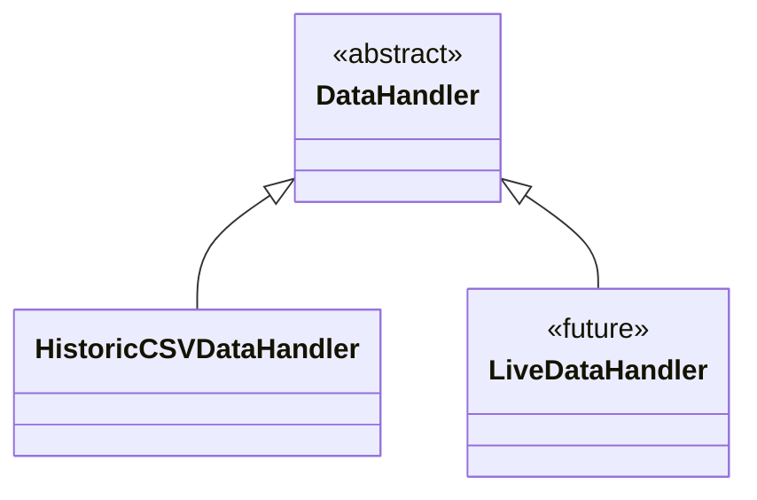

# Bars

Market data handlers that feed OHLCV bars into the system one at a time.

## How Data Is Handled

The DataHandler acts as the heartbeat of the trading system. It controls the pace of the simulation by releasing market data one bar at a time, mimicking how real market data arrives.

### Data Loading

When initialized, the handler loads all historical data for the configured symbols into memory. Each symbol's data is stored separately, indexed by timestamp. The data includes Open, High, Low, Close, Volume (OHLCV) for each bar.

### Drip-Feed Iteration

Instead of exposing all data at once (which would cause look-ahead bias), the handler maintains a pointer to the "current" bar. On each iteration:

1. The pointer advances to the next bar
2. Only data up to and including the current bar is accessible
3. A MarketEvent is emitted to notify the system that new data is available

This ensures strategies can only see past data, never future data.

### Multi-Symbol Alignment

When trading multiple symbols, the handler aligns bars by timestamp. If one symbol has data for a given timestamp but another doesn't, the handler still advances but only includes symbols with available data for that bar.

### Backtest vs Live

For backtesting, data comes from CSV files and the loop runs as fast as possible. For live trading, a future LiveDataHandler would poll the broker API at regular intervals, but the rest of the system remains unchanged.

## Files
- `base.py` - Abstract DataHandler interface
- `csv_handler.py` - CSV file loader

## Classes
- `DataHandler` - Abstract base class
- `HistoricCSVDataHandler` - Loads CSV files for backtesting

## Hierarchy

