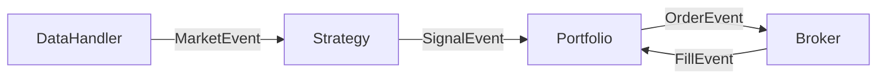

# Engine

Core trading engine that orchestrates all components via an event loop.

## How The Loop Works

The TradingEngine runs two nested loops that process market data and route events to the appropriate handlers.

### Outer Loop (Heartbeat)

The outer loop advances through market data one bar at a time. On each iteration, it tells the DataHandler to release the next bar. This continues until there is no more data (backtest complete) or the system is stopped (live trading).

For backtesting, this loop runs as fast as possible. For live trading, it would pause between iterations to wait for real-time data.

### Inner Loop (Event Processing)

After each new bar is released, events start flowing through the system. The inner loop pulls events from the queue one at a time and routes them based on type:

- **MarketEvent** → Sent to Strategy (to analyze data) and Portfolio (to update valuations)
- **SignalEvent** → Sent to Portfolio (to decide whether to trade)
- **OrderEvent** → Sent to Broker (to execute the trade)
- **FillEvent** → Sent to Portfolio (to update positions and cash)

Each handler may generate new events in response. For example, when Strategy receives a MarketEvent, it may emit a SignalEvent. This triggers a chain reaction through the system.

The inner loop continues until the queue is empty, then the outer loop advances to the next bar.

### Event Chain Example

A single bar of data can trigger a full trade cycle:

1. DataHandler emits MarketEvent
2. Strategy detects pattern, emits SignalEvent
3. Portfolio generates order, emits OrderEvent
4. Broker executes order, emits FillEvent
5. Portfolio updates position

All of this happens before the next bar is processed.

### Why Events?

The event-driven design decouples components. The Strategy doesn't know about the Portfolio. The Broker doesn't know about the Strategy. They only communicate through events. This makes it easy to swap components (different strategies, different brokers) without changing the rest of the system.

## Files
- `trading.py` - TradingEngine class

## Classes
- `TradingEngine` - Universal event loop for backtest and live trading

## Event Flow

