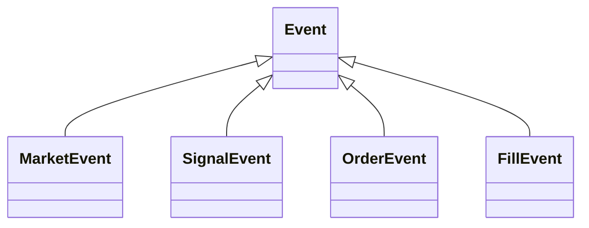

# Events

Event classes for the event queue. Each event type triggers different handlers in the trading engine.

## Files
- `events.py` - All event class definitions

## Classes
- `Event` - Base class
- `MarketEvent` - New market data available
- `SignalEvent` - Trading signal detected (LONG/SHORT)
- `OrderEvent` - Trade request (BUY/SELL)
- `FillEvent` - Order executed with fill details

## Hierarchy

